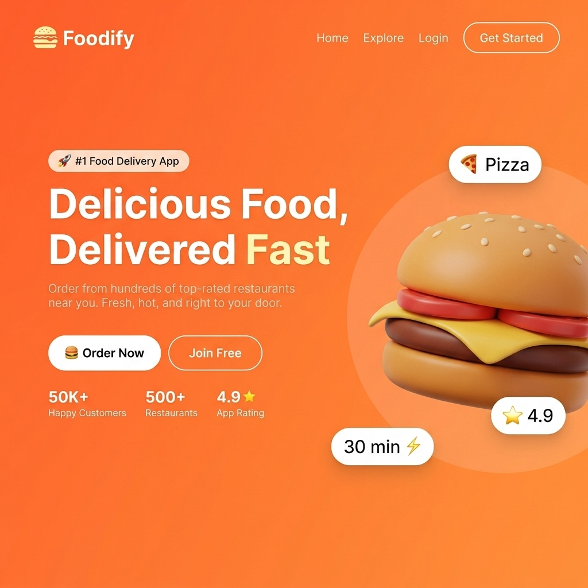
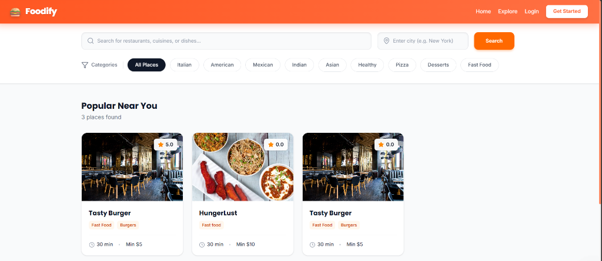
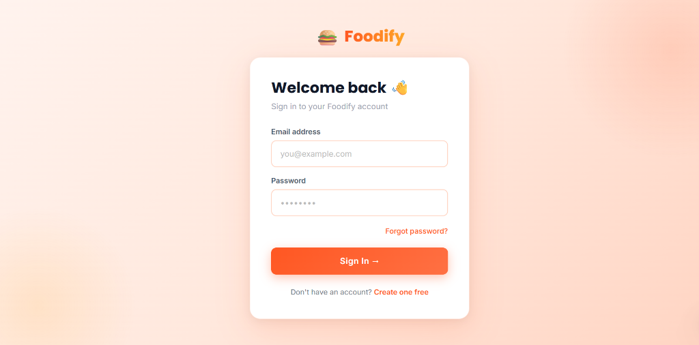
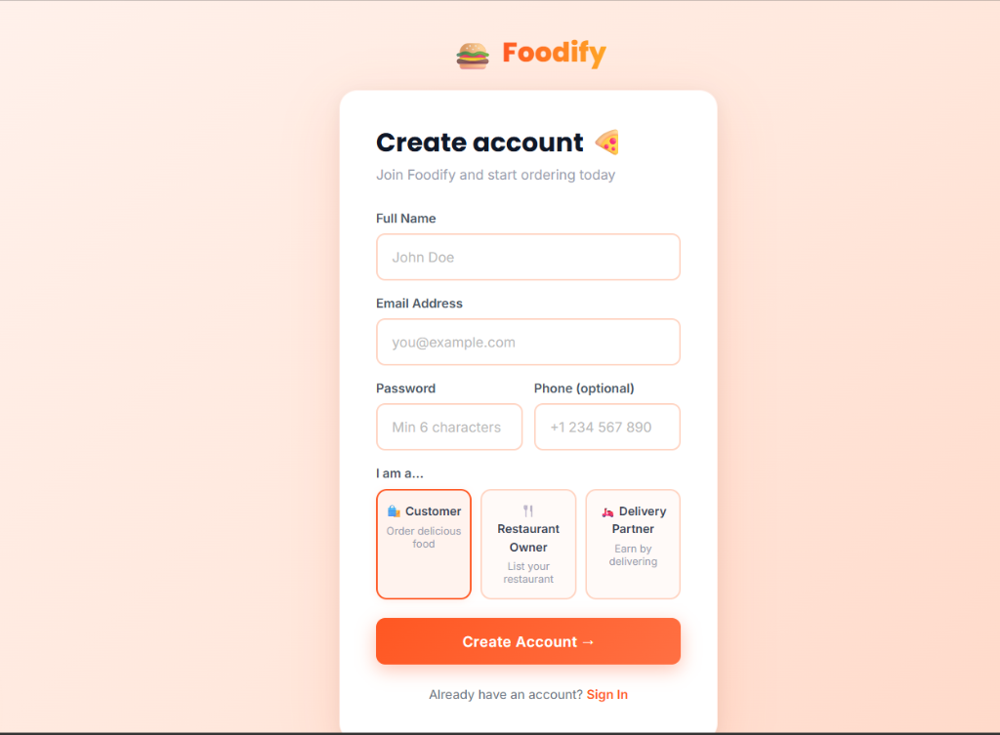
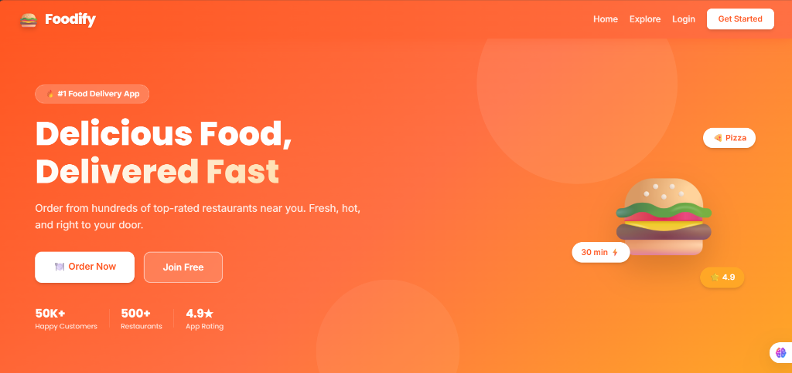

<div align="center">

# 🍔 Foodify

### A Full-Stack Food Delivery Platform

**Built with React · Node.js · Express · MongoDB · Socket.io · Razorpay**

[](https://react.dev)
[](https://nodejs.org)
[](https://www.mongodb.com/atlas)
[](https://socket.io)
[](https://razorpay.com)

</div>

---

## 📌 What is Foodify?

**Foodify** is a production-ready, full-stack food delivery web application — similar to Swiggy or Zomato — built entirely from scratch as a solo project. It supports four distinct user roles (Customer, Restaurant Owner, Delivery Partner, Admin), real-time order tracking via WebSockets, and multiple payment methods including Cash on Delivery, UPI (QR code), and Razorpay online checkout.

> 🎯 **Built to demonstrate end-to-end engineering** — from database schema design and REST API architecture to a responsive React frontend and real-time delivery tracking.

---

## 📸 Screenshots

<table>
  <tr>
    <td align="center" width="50%">
      
      <br/><b>🏠 Landing Page</b>
    </td>
    <td align="center" width="50%">
      
      <br/><b>🔍 Explore Restaurants</b>
    </td>
  </tr>
  <tr>
    <td align="center" width="50%">
      
      <br/><b>🔐 Login</b>
    </td>
    <td align="center" width="50%">
      
      <br/><b>📝 Register with Role Selection</b>
    </td>
  </tr>
  <tr>
    <td align="center" colspan="2">
      
      <br/><b>🍽️ Browse by Cuisine</b>
    </td>
  </tr>
</table>

---

## ✨ Key Features at a Glance

| Feature | Description |
|---|---|
| 🔐 **JWT Auth** | Secure login/register with HTTP-only cookies and role-based access control |
| 🏪 **Multi-Restaurant** | Browse restaurants, filter by cuisine, view ratings & operating hours |
| 🛒 **Smart Cart** | Cart persisted in Redux state with single-restaurant enforcement |
| 📦 **Order Lifecycle** | 7-stage order status flow: Pending → Confirmed → Preparing → Ready → Out for Delivery → Delivered / Cancelled |
| 🗺️ **Live Tracking** | Real-time delivery partner location tracking on an interactive Leaflet map via Socket.io |
| 💳 **3 Payment Methods** | Cash on Delivery, UPI Scan & Pay (QR code), Razorpay online checkout |
| 🖼️ **Image Uploads** | Restaurant/menu images uploaded directly to Cloudinary |
| ⭐ **Reviews & Ratings** | Customers can rate and review completed orders |
| 📊 **Admin Dashboard** | Full platform overview — manage users, restaurants, and orders |
| 📡 **WebSocket Events** | Instant push notifications for new orders, status updates, and delivery assignment |
| 📏 **Distance-Based Fees** | Delivery fee calculated dynamically using GPS coordinates (Haversine formula) |

---

## 🎭 User Roles

The application has **four distinct user roles**, each with their own dedicated dashboard and permissions:

### 👤 Customer
- Browse restaurants and menus
- Add items to cart (single restaurant at a time)
- Checkout with address input and payment method selection
- Track their order live on a map
- View full order history and submit reviews

### 🏪 Restaurant Owner
- Manage restaurant profile (hours, images, delivery radius)
- Add / edit / delete menu items with images and categories
- Receive new orders in real time via WebSocket notifications
- Update order status (Confirm → Preparing → Ready for Pickup)

### 🛵 Delivery Partner
- Register and set availability status
- Get automatically assigned the nearest order when it's ready
- Broadcast live GPS location to customers via Socket.io
- Mark deliveries as completed

### 🛡️ Admin
- Platform-wide dashboard with key metrics
- Manage and moderate all users and restaurants
- View all orders across the platform

---

## 🏗️ System Architecture

```
┌─────────────────────────────────────────────────┐
│                   CLIENT (Vite + React)          │
│                                                  │
│  Redux Toolkit (state) · React Router (routing)  │
│  Tailwind CSS (styling) · Socket.io-client       │
│  Leaflet Maps · Razorpay JS SDK                  │
└────────────────────┬────────────────────────────┘
                     │  REST API + WebSocket
                     ▼
┌─────────────────────────────────────────────────┐
│              SERVER (Node.js + Express 5)        │
│                                                  │
│  JWT Auth · CORS · Cookie-Parser · Multer        │
│  Socket.io (real-time) · Razorpay SDK            │
│  Cloudinary (image storage) · Stripe (optional)  │
└────────────────────┬────────────────────────────┘
                     │  Mongoose ODM
                     ▼
┌─────────────────────────────────────────────────┐
│           MongoDB Atlas (Cloud Database)         │
│                                                  │
│  Users · Restaurants · MenuItems · Orders        │
│  Payments · DeliveryPartners · Reviews           │
└─────────────────────────────────────────────────┘
```

---

## 🛠️ Tech Stack

### Frontend
| Technology | Purpose |
|---|---|
| **React 19** | UI library |
| **Vite 8** | Build tool & dev server |
| **Redux Toolkit** | Global state management (auth, cart, orders) |
| **React Router v7** | Client-side routing & protected routes |
| **Tailwind CSS v4** | Utility-first styling |
| **Socket.io Client** | Real-time WebSocket communication |
| **React Leaflet** | Interactive maps for live order tracking |
| **Axios** | HTTP client with interceptors |
| **Lucide React** | Icon library |
| **React Hot Toast** | Toast notification system |

### Backend
| Technology | Purpose |
|---|---|
| **Node.js + Express 5** | REST API server |
| **MongoDB + Mongoose** | NoSQL database with ODM |
| **Socket.io** | Real-time bidirectional events |
| **JWT + bcryptjs** | Authentication & password hashing |
| **Cloudinary** | Cloud image storage for restaurants/menus |
| **Razorpay** | Online payment gateway with signature verification |
| **Stripe** | Card payments (integrated, optional) |
| **Multer** | Multipart form-data / file uploads |
| **dotenv** | Environment variable management |

---

## 📁 Project Structure

```
foodify/
├── client/                      # React + Vite frontend
│   ├── src/
│   │   ├── app/                 # Redux store setup
│   │   ├── components/          # Reusable UI components
│   │   │   ├── cart/            # Cart sidebar, items
│   │   │   ├── common/          # Navbar, Footer, Loader
│   │   │   ├── maps/            # LiveMap, DeliveryTracker
│   │   │   ├── order/           # Order cards, status badges
│   │   │   └── restaurant/      # Restaurant cards, menu items
│   │   ├── features/            # Redux slices + thunks
│   │   │   ├── auth/            # Login, register, session
│   │   │   ├── cart/            # Cart operations
│   │   │   ├── order/           # Order placement & tracking
│   │   │   └── restaurant/      # Restaurant & menu data
│   │   ├── pages/
│   │   │   ├── admin/           # AdminDashboard, ManageUsers, ManageRestaurants
│   │   │   ├── auth/            # Login, Register pages
│   │   │   ├── delivery/        # DeliveryDashboard, ActiveDelivery
│   │   │   ├── public/          # Home, RestaurantList, MenuPage
│   │   │   ├── restaurant/      # RestaurantDashboard, ManageMenu, Orders
│   │   │   └── user/            # Cart, Checkout, OrderHistory, Tracking
│   │   ├── services/            # Axios API service functions
│   │   ├── hooks/               # useAuth, useCart, useSocket
│   │   └── config/              # appConfig.js (UPI, currency settings)
│   └── .env                     # VITE_API_URL, VITE_RAZORPAY_KEY_ID
│
└── server/                      # Node.js + Express backend
    ├── src/
    │   ├── config/              # DB, Socket.io, Razorpay, Stripe setup
    │   ├── controllers/         # Route handler logic
    │   ├── middleware/          # auth, role, error middleware
    │   ├── models/              # Mongoose schemas
    │   │   ├── User.js          # 4 roles, addresses, bcrypt hashing
    │   │   ├── Restaurant.js    # Geo-indexed, operating hours
    │   │   ├── MenuItem.js      # Categories, dietary flags
    │   │   ├── Order.js         # 7-stage status enum, payment ref
    │   │   ├── Payment.js       # COD / UPI / Razorpay / Stripe
    │   │   ├── DeliveryPartner.js # GeoJSON location, availability
    │   │   └── Review.js        # Star rating, comment, verified
    │   ├── routes/              # 9 route files (auth, user, restaurant, etc.)
    │   ├── services/            # Business logic (payment, delivery, order)
    │   ├── sockets/             # location.socket.js (live GPS broadcasting)
    │   ├── utils/               # calculateDistance, logger
    │   └── validators/          # Request body validation
    └── .env                     # MongoDB, JWT, Cloudinary, Razorpay secrets
```

---

## 🔌 API Endpoints

| Method | Endpoint | Description | Auth |
|---|---|---|---|
| `POST` | `/api/auth/register` | Register a new user | Public |
| `POST` | `/api/auth/login` | Login & set JWT cookie | Public |
| `GET` | `/api/auth/me` | Get current user profile | 🔒 |
| `GET` | `/api/restaurants` | List all restaurants | Public |
| `GET` | `/api/restaurants/:id` | Restaurant details + menu | Public |
| `POST` | `/api/restaurants` | Create restaurant | 🔒 Owner |
| `GET` | `/api/menu/:restaurantId` | Get menu items | Public |
| `POST` | `/api/menu` | Add menu item | 🔒 Owner |
| `POST` | `/api/orders` | Place a new order | 🔒 |
| `GET` | `/api/orders/my` | Get my orders | 🔒 |
| `PUT` | `/api/orders/:id/status` | Update order status | 🔒 Owner/Admin |
| `PUT` | `/api/orders/:id/cancel` | Cancel an order | 🔒 |
| `POST` | `/api/orders/verify-payment` | Verify Razorpay signature | 🔒 |
| `GET` | `/api/delivery/active` | Get active delivery | 🔒 Partner |
| `POST` | `/api/reviews` | Submit a review | 🔒 |
| `GET` | `/api/admin/users` | List all users | 🔒 Admin |
| `GET` | `/api/health` | Server health check | Public |

---

## ⚡ Real-Time WebSocket Events

| Event | Direction | Description |
|---|---|---|
| `join:user` | Client → Server | Join personal notification room |
| `join:restaurant` | Client → Server | Restaurant joins order room |
| `join:order` | Client → Server | Customer/partner joins order room |
| `order:new` | Server → Restaurant | New order received notification |
| `order:assigned` | Server → Customer | Delivery partner assigned |
| `order:delivered` | Server → Customer | Order marked delivered |
| `location:update` | Partner → Server | GPS coordinates broadcast |
| `location:broadcast` | Server → Customer | Live partner location update |

---

## 🚀 Getting Started (Local Development)

### Prerequisites
- Node.js v18+
- MongoDB Atlas account (free tier works)
- Cloudinary account (free tier works)

### 1. Clone the repository
```bash
git clone https://github.com/pankaj332004/foodify.git
cd foodify
```

### 2. Install dependencies
```bash
# Install all dependencies (client + server)
npm run install:all
```

### 3. Configure environment variables

**Server** — create `server/.env`:
```env
NODE_ENV=development
PORT=5000
MONGO_URI=mongodb+srv://<user>:<password>@cluster.mongodb.net/foodify
JWT_SECRET=your_super_secret_key
JWT_EXPIRES_IN=7d
CLIENT_URL=http://localhost:5173

CLOUDINARY_CLOUD_NAME=your_cloud_name
CLOUDINARY_API_KEY=your_api_key
CLOUDINARY_API_SECRET=your_api_secret

RAZORPAY_KEY_ID=rzp_test_your_key
RAZORPAY_KEY_SECRET=your_secret
```

**Client** — create `client/.env`:
```env
VITE_API_URL=http://localhost:5000
VITE_RAZORPAY_KEY_ID=rzp_test_your_key
```

### 4. Run the application

```bash
# Terminal 1 — Start the backend server
npm run server

# Terminal 2 — Start the frontend dev server
npm run client
```

- 🖥️ **Frontend:** http://localhost:5173
- 🔧 **Backend API:** http://localhost:5000
- 💓 **Health Check:** http://localhost:5000/api/health

---

## 🧪 Test Accounts (Demo)

You can register with any of these roles during signup:

| Role | How to get it |
|---|---|
| **Customer** | Default role on registration |
| **Restaurant Owner** | Select "Restaurant Owner" during signup |
| **Delivery Partner** | Select "Delivery Partner" during signup |
| **Admin** | Set `role: "admin"` directly in MongoDB (or promote via admin panel) |

---

## 🗺️ Roadmap / Future Enhancements

- [ ] Email notifications (order confirmation, OTP)
- [ ] Push notifications (browser PWA)
- [ ] Advanced search & cuisine-based filtering
- [ ] Promo codes & discount system
- [ ] Earnings dashboard for delivery partners
- [ ] Mobile app (React Native)

---

## 👨‍💻 Author

**Pankaj Kumar Rajbhar**

Built end-to-end as a solo full-stack project demonstrating:
- **REST API design** with proper separation of concerns (controllers / services / validators)
- **Real-time systems** with Socket.io rooms and GPS broadcasting
- **Payment gateway integration** (Razorpay + Stripe)
- **Role-based access control** with JWT and middleware
- **Cloud storage** (Cloudinary) and geo-indexed MongoDB queries
- **Production-ready** code with error handling, logging, and environment-based configuration

---

<div align="center">

⭐ **If you found this project impressive, please give it a star!**

</div>
